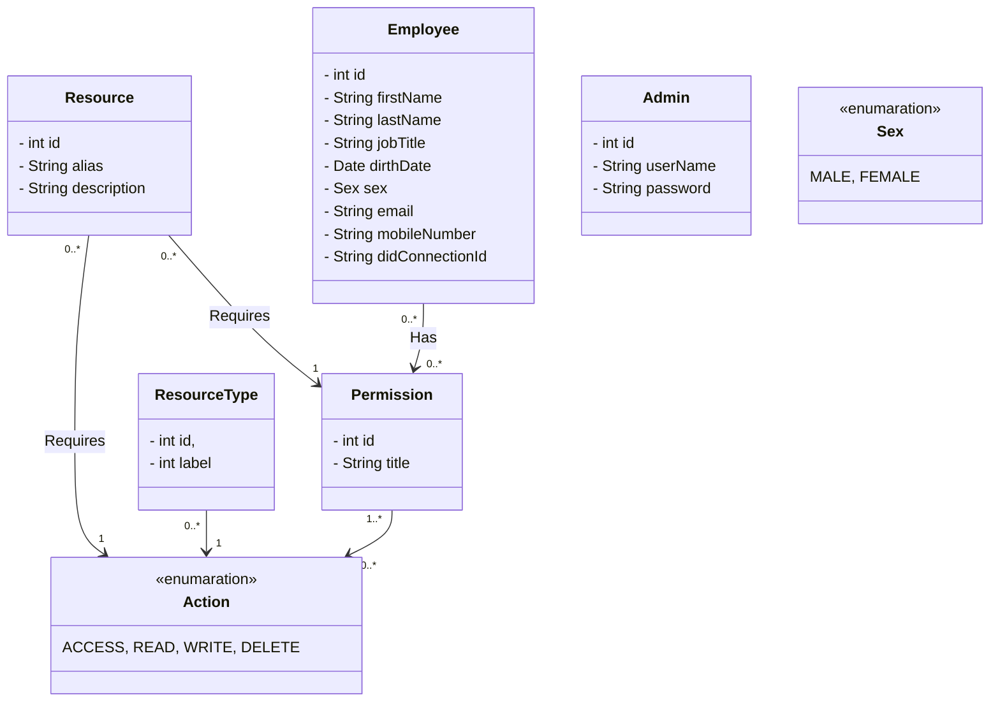

# ams-back

Access management system backend repo responsible for handling the business logic of ACA-PY

## Projects class diagram

Mermaid diagram.



### What a credential may look like

```json
{
    "employee": {
        "firstName": "Vasileios",
        "LastName": "Konstantinou",
        "jobTitle": "Software developer",
        "dirthDate": "2022-06-12T13:44:31Z",
        "sex": "male",
        "email": "a@a.gr",
        "mobileNumber": "+306977177481",
        "permisions": [
            {
                "id": 1,
                "alias": "MEETING_ROOM_1",
                "action": ["ACCESS"]
            },
            {
                "id": 2,
                "alias": "CAFETERIA",
                "action": ["ACCESS"]
            },
            {
                "id": 2,
                "alias": "S3",
                "path": "/"
                "action": ["READ", "WRITE", "DELETE"]
            },
        ],
    },

}
```